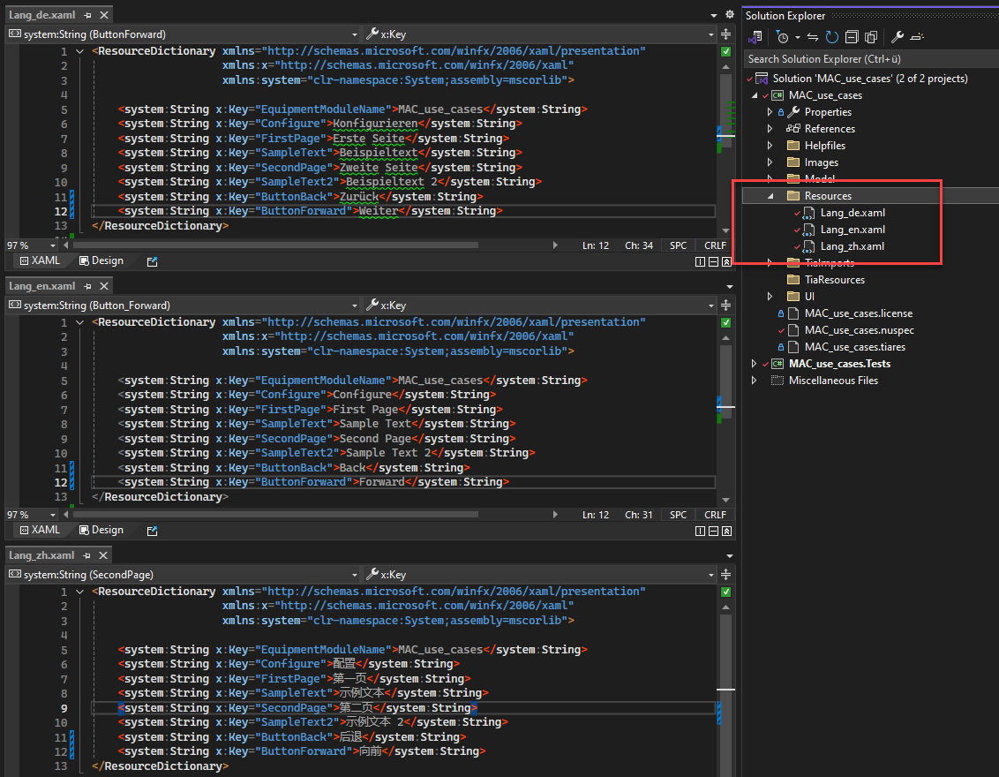

# Overview

## Quick Navigation

1. [Use Cases](namespace_m_a_c__use__cases_1_1_model_1_1_use_cases.html)
    1. [Create Variables](class_m_a_c__use__cases_1_1_model_1_1_use_cases_1_1_create_variables.html)
    2. [General Support](class_m_a_c__use__cases_1_1_model_1_1_use_cases_1_1_general_support.html)
    3. [Generic Block Generation](class_m_a_c__use__cases_1_1_model_1_1_use_cases_1_1_generic_block_creation.html)
    4. [Hardware Generation](class_m_a_c__use__cases_1_1_model_1_1_use_cases_1_1_hardware_generation.html)
    5. [Use Integrated Libraries](class_m_a_c__use__cases_1_1_model_1_1_use_cases_1_1_integrate_libraries.html)
    6. [Model Serialization](class_m_a_c__use__cases_1_1_model_1_1_use_cases_1_1_model_to_serialize.html)
    7. [Non Tia Portal Bases Operations](class_m_a_c__use__cases_1_1_model_1_1_use_cases_1_1_non_t_i_a_project_based.html)
    8. [Technology Object Handling](class_m_a_c__use__cases_1_1_model_1_1_use_cases_1_1_technology_object_class.html)
    9. [Software Units](class_m_a_c__use__cases_1_1_model_1_1_use_cases_1_1_software_units.html)
2. [How to integrate libraries](@ref section-id)
3. [How to use different lanugages](@ref localization-id)
4. [Help for this documentation](@ref help-id)

## How to integrate libraries {#section-id}

With the help of the .tiares file, libraries can be easily integrated in the Module Builder. To do this, the file must first be opened in Visual Studio.


In the newly opened window, the selection menu can now be opened using the button in the top left-hand corner.
The desired library must then be selected there.


By clicking on the "Mastercopies" area and then pressing the "Add" button, everything is included. This window can then be closed again, as everything is saved automatically.


To integrate parts of the library use the code explainned in [Use Integrated Libraries](class_m_a_c__use__cases_1_1_model_1_1_use_cases_1_1_integrate_libraries.html)

## How to use different lanugages {#localization-id}

Currently the Modular Application Creator supports following languages:

- en - English
- de - German
- zh - Chinese

The language can be changed during runtime in the settings menu. Depending on the selected language one of the defined XAML ResourceDictionary will be used.



Create KeyValue pairs in the ResourceDictionaries with matching Key and use them with DynamicResource Binding in your XAML files:

```xaml
        <TextBlock Text="{DynamicResource SampleText}" />
```

## Help for this documentation {#help-id}

### Classes

The "Classes" section explains the classes used in the project.
In addition to the explanation of the class and a first overview of all functions used in the class, the page contains a detailed explanation of all functions of the class.


In all explanatory sections there is a short literal explanation of the function and its parameters, as well as a picture of the resulting result in the Tia Portal after generation.
Also included is the used code of the function and a link to the code of the whole class.


### Files

The above-mentioned link to the class code then points to the files contained in the "Files" section.
There, all classes in the C# code are included again to show how the classes look as simple as possible.
It is also possible to copy the code to reuse it in your own modules.

