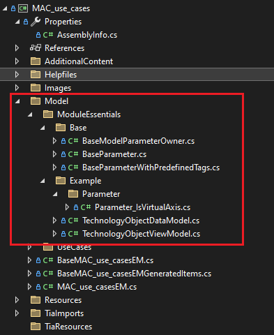
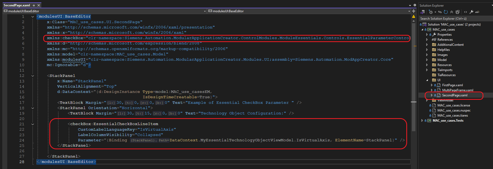

# Advanced
## Module Essentials  

### Overview  
The **Module Essentials** is a control module designed to streamline the development process. It serves as a NuGet package that helps developers quickly build user interfaces and efficiently manage dependencies between UI controls.  

### Key Features  
- **Rapid UI Development**: Simplifies the creation of user interfaces, reducing development time.  
- **Dependency Management**: Handles dependencies between UI controls with ease, ensuring smooth integration and functionality.  
- **NuGet Integration**: Easily accessible as a NuGet package, making it simple to add to your projects.  

### Getting Started
To use the **Module Essentials** in your project:  
    Install the NuGet package: "Siemens.ModularApplicationCreator.ControlModules.ModuleEssentials"  
    https://www.nuget.org/packages/Siemens.ModularApplicationCreator.ControlModules.ModuleEssentials
    
   ### Versioning  
   - The versioning system of **Module Essentials** ensures compatibility with TIA Portal.  
   - The **first number** of the version number corresponds to the supported TIA Portal version.

   ### Architecture
   To effectively use **Module Essentials**, you must understand the underlying architecture of the module.
   Each Data Model is essentially a data container that holds multiple parameters.
   The model provides a parameter register, where developers can add each parameter as needed based on their specific requirements.
   For example, if you have an "axis" with various settings, the axis serves as your model, and each individual setting parameter must be properly defined and registered within that model.
   This architecture allows for flexible and organized management of related parameters within a cohesive data structure.

   ### Parameter Types
   - In the context of **Module Essentials**, any UI control is considered a parameter.  
      - Example: A parameter like `Velocity` must have a corresponding class defined for it, typically inheriting from the `BaseParameter` class.  
   - Types of parameters:  
      - **Simple Parameters**:  
        - Hold a single value.  
        - Example: A text box or numeric input field for entering a single value.  
        - These parameters are often implemented using classes derived from `BaseParameter`.  
      - **Collection Parameters**:  
        - Designed for collections and often displayed as ComboBoxes.  
        - Example: A dropdown menu for selecting an item from a **predefined** list.  
        - These parameters can also be implemented using `BaseParameter` as the base class.  
    - UI controls are optional:  
      - Developers can choose whether or not to implement UI controls based on their specific requirements. ✅

   ### Example of Module Essentials Usage

   Here is an example of the classes needed to use the Module Essentials:

   

   #### UI Control Binding
   To use parameters as UI controls in your application, you must bind them to the corresponding controls in the XAML file.
   This binding establishes the connection between your parameter classes and the visual elements in the user interface, enabling data flow and user interaction.
   The binding process typically involves setting the `DataContext` or using specific binding expressions that reference your parameter properties.

   #### Example of Control Binding Usage

   
      
